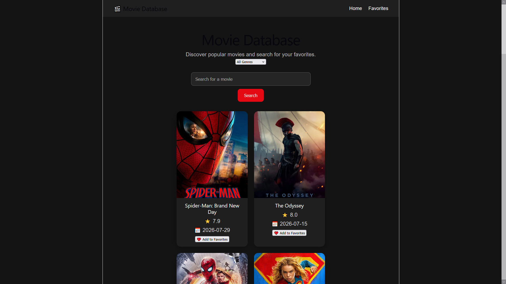
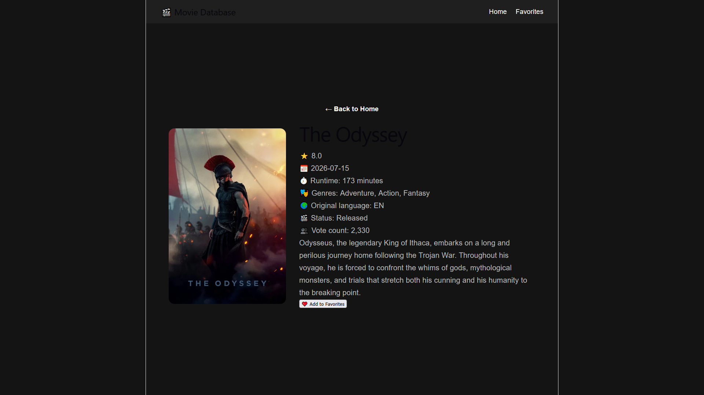
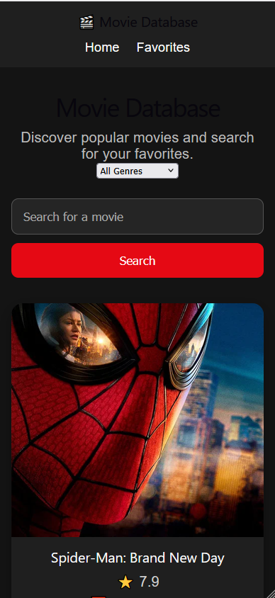

# 🎬 Movie Database

A responsive movie discovery application built with React and TypeScript using The Movie Database (TMDB) API.

Users can browse popular movies, search for movies, filter results by genre, view detailed movie information, and save their favorite movies.

## 🌐 Live Demo

Live demo coming soon.

## ✨ Features

- Browse popular movies
- Search for movies by title
- Filter movies by genre
- Combine movie search with genre filtering
- View detailed information for each movie
- Add and remove movies from favorites
- Save favorites using localStorage
- Navigate through movie results with pagination
- Jump directly to the first or last page
- Clear an active search
- Handle searches with no results
- Responsive design for desktop and mobile devices


## 🛠️ Technologies Used

- React
- TypeScript
- Vite
- React Router
- TMDB API
- CSS
- localStorage


## 🚀 Getting Started

### 1. Clone the repository

```bash
git clone https://github.com/jbloch100/movie-database.git
```

### 2. Navigate to the project

```bash
cd movie-database
```

### 3. Install dependencies

```bash
npm install
```

### 4. Create an environment file

Create a .env file in the root of the project and add

```bash
VITE_TMDB_TOKEN=your_tmdb_api_token
```

You will need a TMDB API token to run the application.

### 5. Start the development server

```bash
npm run dev
```

## 📁 Project Structure

```text
src/
├── components/
│   └── MovieCard.tsx
├── pages/
│   ├── Home.tsx
│   ├── Favorites.tsx
│   └── MovieDetails.tsx
├── services/
│   ├── tmdb.ts
│   └── favorites.ts
├── types/
│   ├── Movie.ts
│   ├── Genre.ts
│   └── MovieResponse.ts
├── App.tsx
├── App.css
└── main.tsx
```

## 🧠 What I Learned

While building this project, I practiced:

- Fetching and displaying data from a REST API
- Working with asynchronous JavaScript using async/await
- Managing state with React hooks
- Using useEffect for API requests
- Creating reusable React components with TypeScript
- Implementing dynamic routes with React Router
- Managing URL parameters with useParams
- Handling loading and error states
- Saving and retrieving data with localStorage
- Refactoring shared logic into reusable services
- Implementing pagination
- Filtering and searching API data
- Building responsive layouts with CSS media queries

## 📸 Screenshots

### Home Page



### Movie Details



### Favorites


### Mobile View




